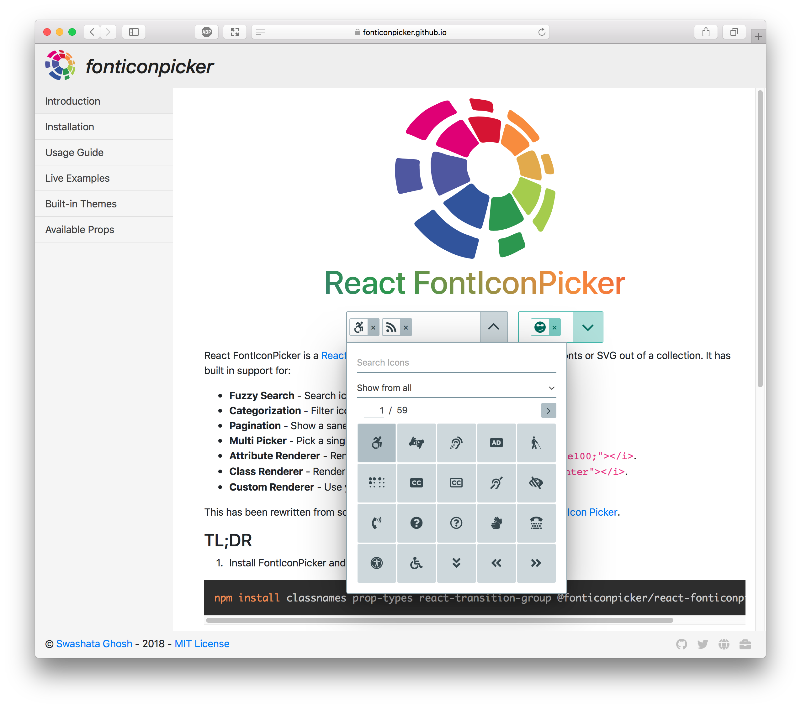
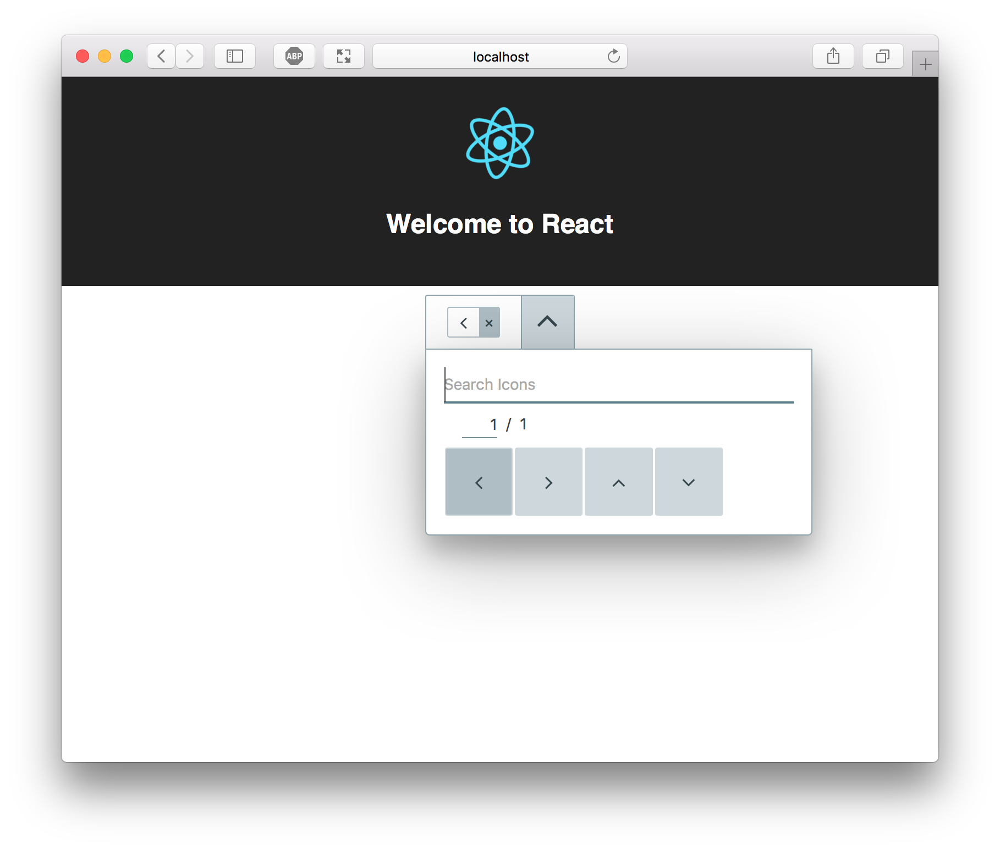

<!---
 Copyright (c) 2018 Swashata Ghosh <swashata@wpquark.com>

 This software is released under the MIT License.
 https://opensource.org/licenses/MIT
-->

# React FontIconPicker Component

[](https://codecov.io/gh/fontIconPicker/react-fonticonpicker) [](https://travis-ci.org/fontIconPicker/react-fonticonpicker) [](https://github.com/facebook/jest) [](https://badge.fury.io/js/%40fonticonpicker%2Freact-fonticonpicker) [](https://david-dm.org/fontIconPicker/react-fonticonpicker?type=peer) [](https://github.com/fontIconPicker/react-fonticonpicker/blob/master/LICENSE)

-------------------------

[](fonticonpicker.png)

A react version of [fontIconPicker](https://fonticonpicker.github.io). This is
rewritten and is not a wrapper around jQuery version.

With FontIconPicker component you can present an UI where people can pick one or
more fonts. In bare-bone it looks like this.

## Installation

### NPM or YARN

NPM is the preferred way of installation. You can find it from [here](https://www.npmjs.com/package/@fonticonpicker/react-fonticonpicker).

From your project do

```bash
npm i @fonticonpicker/react-fonticonpicker
```

Also install the peer dependencies yourself.

```bash
npm i react react-dom classnames prop-types react-transition-group
```

And require the file.

#### ES6

```js
import FontIconPicker from '@fonticonpicker/react-fonticonpicker';
```

#### ES5

```js
const FontIconPicker = require('@fonticonpicker/react-fonticonpicker');
```

And use it as React Component. Check the [documentation site](http://fonticonpicker.github.io/react-fonticonpicker/) for more example.


### CDN

For some reason, if you'd prefer the CDN, then it is available at [unpkg.com](https://unpkg.com/@fonticonpicker/react-fonticonpicker/dist/).

Place them in your HTML document, along with UMD builds of peer dependencies.

### Download Source

We distribute production version of source file through [github releases](https://github.com/fontIconPicker/react-fonticonpicker/releases). Head over there
and download `fonticonpicker.react.zip` file.

## Usage

Here is an example for use with the [create-react-app](https://github.com/facebook/create-react-app).

From your project directory do:

```bash
yarn add classnames prop-types react-transition-group @fonticonpicker/react-fonticonpicker
```

Now edit your `App.js` file to include the following.


```js
import React, { Component } from 'react';
import FontIconPicker from '@fonticonpicker/react-fonticonpicker';
import logo from './logo.svg';
import './App.css';
import '@fonticonpicker/react-fonticonpicker/dist/fonticonpicker.base-theme.react.css';
import '@fonticonpicker/react-fonticonpicker/dist/fonticonpicker.material-theme.react.css';

class App extends Component {
  constructor(props) {
    super(props);
    this.state = {
      value: 'fipicon-angle-left',
    };
  }
  handleChange = (value) => {
    this.setState({ value });
  }
  render() {
    const props = {
      icons: ['fipicon-angle-left', 'fipicon-angle-right', 'fipicon-angle-up', 'fipicon-angle-down'],
      theme: 'bluegrey',
      renderUsing: 'class',
      value: this.state.value,
      onChange: this.handleChange,
      isMulti: false,
    };
    return (
      <div className="App">
        <header className="App-header">
          
          <h1 className="App-title">Welcome to React</h1>
        </header>
        <FontIconPicker {...props} />
      </div>
    );
  }
}

export default App;
```

[](create-react-app.png)

This will render a basic FontIconPicker component. For advanced usage, follow
the [documentation](https://fonticonpicker.github.io/react-fonticonpicker/).

## Props

| Prop | Type | Required | Default |
|------|------|-----------|---------|
| icons | `object` of `array` or `array` | yes | N/A |
|onChange| `func` | yes | N/A |
| search | `object` of `array` or `array`| no | `null`|
|iconsPerPage| number | no | `20` |
|theme | `string` | no | `'default'`|
| showCategory| `bool` | no | `true` |
| showSearch | `bool` | no | `true` |
| value | `array` or `string` | no | null |
| isMulti | `bool` | no | `false` |
| renderUsing | `string` | no | `'class'` |
| convertHex | `bool` | no | `true` |
| renderFunc | `func` | no | null |
| appendTo | `string` | no | false |
| allCatPlaceholder | `string` | no | `'Show from all'` |
| searchPlaceholder | `string` | no | `'Search Icons'` |
| noIconPlaceholder | `string` | no | `'No icons found'` |
| noSelectedPlaceholder | `string` | no | `'Select icon'` |


## Development Environment

Development & Build is done with the help of [webpack](https://webpack.js.org/).

First fork and git clone the repo on your machine.

```bash
git clone git@github.com:<username>/react-fonticonpicker.git
```

Now install all the dependencies. Make sure you have [nodejs](https://nodejs.org/en/)
version 9 or higher.

```bash
npm install
```

Now run the server with

```bash
npm start
```

This will open a webpack dev server with hot reload. You can access the server
from [http://localhost:7770](http://localhost:7770).

Now make changes in the component and see it live. Also add unit tests and
integration tests where applicable.

If your changes invalidates snapshots, then make sure to update them too (with
good reasons).

When doing a PR, try not to build the docs or the dist. It will create unnecessary
merge conflict.

Other npm commands at disposal:

* `npm run test`: Runs `eslint` followed by `stylelint` and `jest` tests.
* `npm run start`: Runs a dev server with hot reload.
* `npm run docs`: Builds the docs for production.
* `npm run build`: Builds the UMD & CSS files for distribution.

## Credits

React FontIconPicker has been developed by [Swashata](https://swashata.me) mainly for in use with [eForm](https://eform.live).
The original idea came from [jQuery FontIconPicker](https://github.com/fontIconPicker/fontIconPicker)
by [Alessandro Benoit](http://codeb.it).

None of these would have been possible without the cool [Wes Bos 🔥](https://wesbos.com/)
and his [react for beginners course](https://reactforbeginners.com/). It is awesome 😉.
